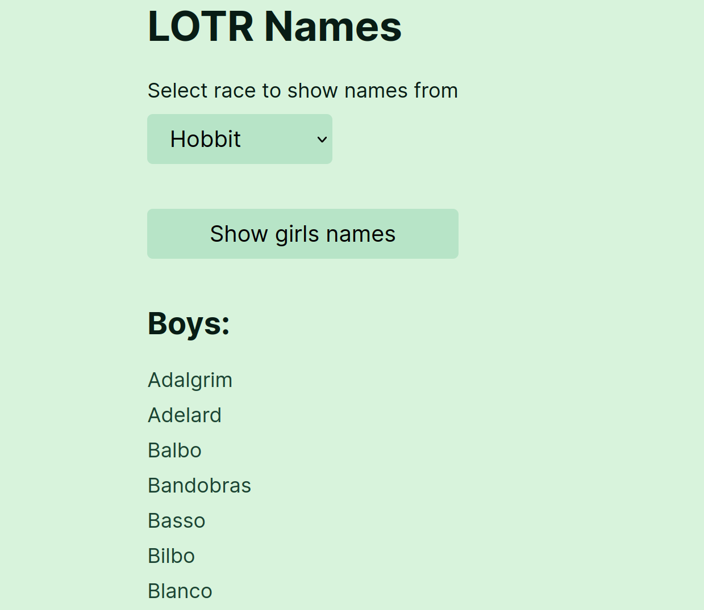

# Hobbit Names

> Lists of names from The Lord of the Rings using [The One API](https://the-one-api.dev/)

## Table of contents

- [General info](#general-info)
- [Screenshots](#screenshots)
- [Technologies](#technologies)
- [Learnings](#learnings)
- [Setup](#setup)
- [Status](#status)
- [Contact](#contact)

## General info

I name my hamsters using names from Lord of the Rings. I wanted lists of names in one place to make it easier to choose a name. I also wanted them split species and then by boys names and girls names, so I only had to look at one list depending on whether I was naming a boy or a girl hamster.

## Screenshots



## Technologies

- React
- Express
- Vite
- Vitest
- The One API

## Learnings

- Using Express with Vite
- Using Vitest

## Setup

To view this project download the files, open a terminal in that folder and install locally using npm:

```
npm install
```

Go to [The One API](https://the-one-api.dev/), sign up for an account and get an API key.

Add your key into .env.example where it says 'XXX' and rename the file to .env

Run the server and the app locally:

```
npm run dev
```

## Status

Project is: _finished_

## Contact

Created by [nicm42](https://twitter.com/nicm4242/) - feel free to contact me!
